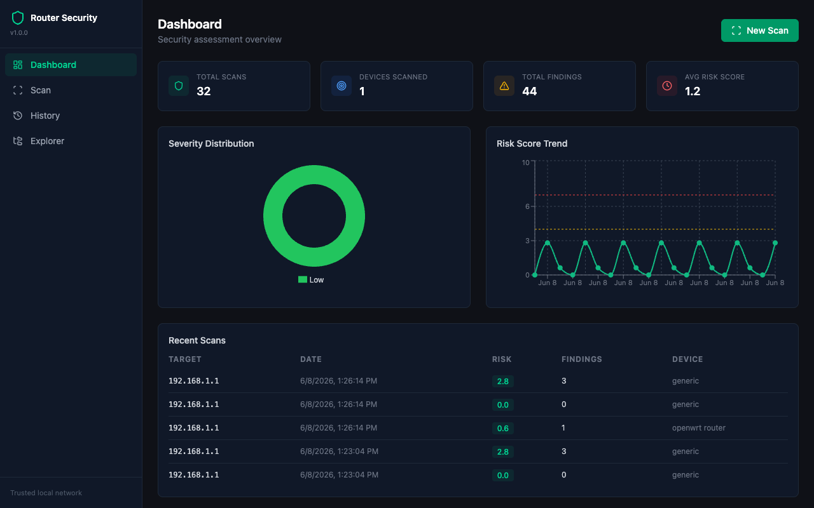

# Router Security Tool

[](https://github.com/DevenDucommun/router-security-tool/actions/workflows/ci.yml)
[](https://www.python.org/downloads/)
[](LICENSE)

A full-stack security assessment platform for network devices. Connects to routers via SSH, runs 40+ automated security checks with device-specific profiles, and presents findings through a real-time web dashboard.

**Tech Stack:** React 18 + TypeScript + Tailwind CSS | FastAPI + WebSocket | SQLite | Paramiko SSH | Docker



## Key Features

- **Real-time scanning** via WebSocket with live progress feed
- **Auto-detection** of device platform (OpenWrt, Linksys, Cisco IOS) with vendor-specific checks
- **Risk scoring** algorithm with severity-weighted findings and trend tracking
- **Web dashboard** with severity distribution charts, risk trends, and scan history
- **Remote filesystem explorer** with security finding annotations
- **Multi-format export** (JSON, HTML, PDF) for reporting
- **CLI mode** with exit codes suitable for CI/CD pipelines
- **Single-container Docker deployment** (multi-stage build: Node frontend + Python backend)

## Architecture

```
┌────────────────────────────────────────────────────────────────┐
│                  React SPA (Vite + TypeScript + Tailwind)       │
│  Dashboard │ Scan (WebSocket) │ History │ Filesystem Explorer  │
└───────────────────────────┬────────────────────────────────────┘
                            │ REST + WebSocket
┌───────────────────────────┴────────────────────────────────────┐
│                     FastAPI Backend                              │
│  /api/scan  /api/devices  /api/history  /api/export  /ws/scan  │
└───────┬────────────┬───────────────┬───────────────────────────┘
        │            │               │
┌───────┴──────┐ ┌───┴────────┐ ┌───┴─────────┐
│  Assessment  │ │ Connections│ │  Database   │
│  Engine      │ │ Manager    │ │  (SQLite)   │
│  ──────────  │ │ ─────────  │ │  ─────────  │
│  ssh_assessor│ │ SSH/Serial │ │ scan_history│
│  profiles/*  │ │ detector   │ │ cve_manager │
│  vuln_scanner│ │            │ │             │
└──────────────┘ └────────────┘ └─────────────┘
```

## Quick Start

### Web UI (recommended)

```bash
git clone https://github.com/DevenDucommun/router-security-tool.git
cd router-security-tool
python3 -m venv .venv && source .venv/bin/activate
pip install -e ".[dev]"
cd web && npm install && npm run build && cd ..
router-security-web
# Open http://localhost:8000
```

### Docker

```bash
docker build -t router-security-tool .
docker run --rm -p 8000:8000 --network host router-security-tool
```

### CLI Only (no Node.js required)

```bash
pip install git+https://github.com/DevenDucommun/router-security-tool.git
router-security-tool scan 192.168.1.1 -u root -p $ROUTER_PASS
```

### Development (hot reload)

```bash
# Terminal 1: Backend
source .venv/bin/activate
uvicorn api.main:app --reload --app-dir src

# Terminal 2: Frontend
cd web && npm run dev
# Open http://localhost:5173 (proxies API to :8000)
```

## How It Works

1. **Connects** to a target device over SSH (paramiko)
2. **Auto-detects the platform** from SSH banner, filesystem, and system info
3. **Runs generic checks** — SSH hardening, default credentials, exposed services, firewall rules, file permissions, running processes
4. **Runs profile-specific checks** — vendor-appropriate security items for the detected platform
5. **Scores risk** using a severity-weighted algorithm (Critical=10, High=7.5, Medium=5, Low=2, Info=0.5) with a density multiplier
6. **Streams progress** over WebSocket to the frontend in real time
7. **Persists results** to SQLite for historical trend analysis

## Device Profiles

| Profile | Detection Signal | Example Checks |
|---------|-----------------|----------------|
| **OpenWrt** | `/etc/openwrt_release` | UCI firewall zones, LuCI exposure, wireless encryption, package audit, DNS rebinding |
| **Linksys** | Hostname `Community*` | JNAP API auth, firmware age, `/tmp/syscfg` permissions, cloud agent, default SSID |
| **Cisco IOS** | `Cisco IOS` in version | enable password type, VTY ACLs, SNMP communities, CDP, AAA, remote logging |

Adding a new profile: subclass `DeviceProfile`, implement `matches()` and `run_checks()`, register in `detect.py`.

## API Reference

| Method | Path | Description |
|--------|------|-------------|
| GET | `/api/health` | Health check |
| POST | `/api/scan` | Run assessment (returns full result) |
| WS | `/ws/scan` | Run assessment with real-time progress |
| GET | `/api/devices` | Auto-discover network devices |
| GET | `/api/history` | List scan history (filterable by target, risk level) |
| GET | `/api/history/stats` | Aggregate statistics |
| DELETE | `/api/history/{id}` | Delete a scan record |
| POST | `/api/export/{format}` | Generate report (json/html/pdf) |
| POST | `/api/filesystem` | Explore remote filesystem |

Interactive API docs: `http://localhost:8000/docs` (Swagger UI)

## Testing

```bash
# Unit tests (234 tests covering API, profiles, CLI, scanner, database, export)
pytest tests/unit/ -v

# Integration tests against a live device
ROUTER_PASS=yourpass pytest tests/integration/ -m network -v

# Coverage report
pytest --cov=src tests/unit/
```

## Project Structure

```
src/
├── api/              # FastAPI app, routes, schemas, WebSocket handler
├── assessment/       # SSH assessor, security check orchestration
├── connections/      # SSH/serial connection manager, device detector
├── database/         # SQLite scan history, CVE manager
├── profiles/         # Device-specific security profiles (OpenWrt, Linksys, Cisco)
├── reports/          # Export engine (JSON, HTML, PDF)
├── scraper/          # Remote filesystem explorer
└── utils/            # Mock data generator, helpers
web/
├── src/
│   ├── components/   # Charts, layout, scan UI components
│   ├── pages/        # Dashboard, Scan, History, Explorer
│   ├── api/          # REST client, WebSocket hook
│   └── hooks/        # Keyboard shortcuts
└── vite.config.ts    # Dev proxy + Tailwind
tests/
├── unit/             # 234 unit tests
└── integration/      # Live device tests (requires SSH access)
```

## Security Notice

This tool is for **authorized security assessments only**. Only use on devices you own or have explicit written permission to test.

## License

MIT — see [LICENSE](LICENSE).
